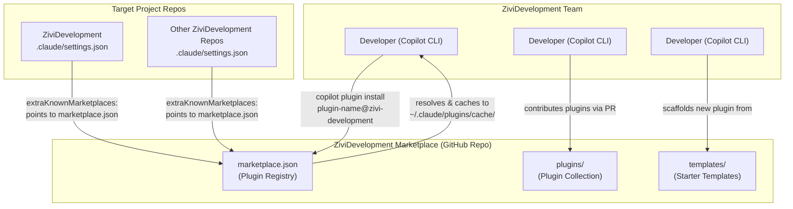
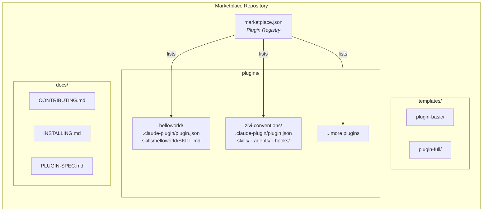
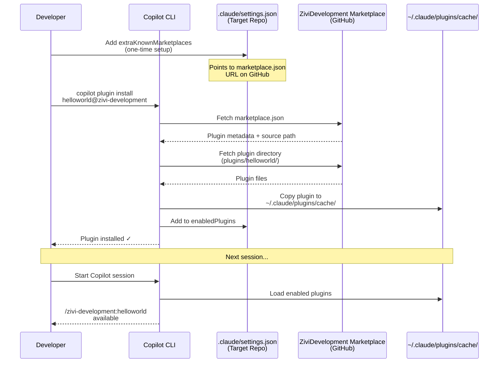
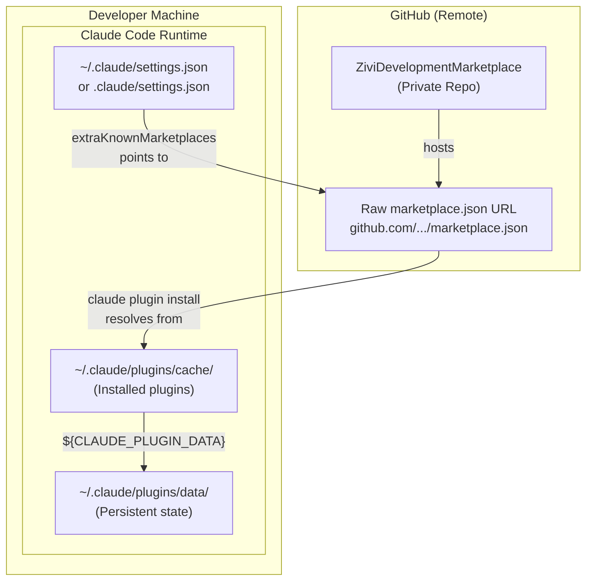
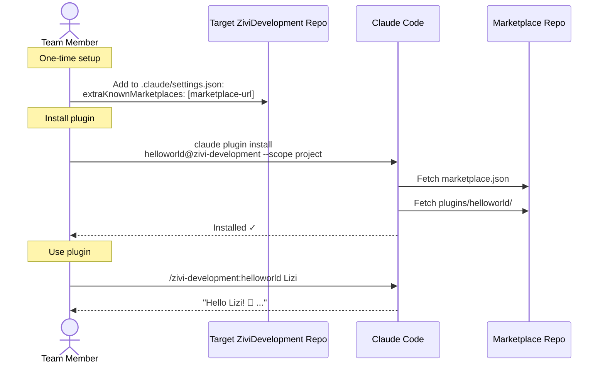
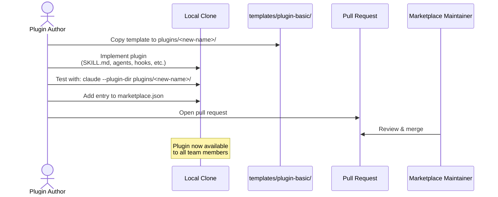

# ZiviDevelopment Marketplace — Architecture Plan

## Executive Summary

The **ZiviDevelopment Marketplace** is a team-managed Copilot plugin marketplace for ZiviDevelopment team. It provides a centralized repository where team members can browse, install, and contribute shared plugins — including skills, agents, hooks, MCP servers, and output styles — that standardize workflows, accelerate development, and encode team knowledge into reusable automation.

This document defines the repository folder structure, file formats, plugin conventions, installation flow, and contribution workflow based on official Copilot plugin standards (March 2026).

---

## System Context



### Key Actors

| Actor | Role |
|-------|------|
| **Plugin Consumer** | Installs plugins from this marketplace into their Copilot environment |
| **Plugin Author** | Creates and maintains plugins via pull requests |
| **Marketplace Maintainer** | Reviews PRs, manages `marketplace.json` catalog |
| **Copilot CLI** | Discovers, installs, caches, and loads plugins at runtime |

---

## Architecture Overview

The marketplace is a **Git-hosted plugin registry** that follows Copilot's plugin distribution model. It contains:

1. **`marketplace.json`** — The registry file that Copilot reads to discover available plugins
2. **`plugins/`** — Individual plugin directories, each with the standard `.claude-plugin/plugin.json` manifest
3. **`templates/`** — Starter scaffolds for creating new plugins
4. **`docs/`** — Contribution and installation guides

### Design Principles

- **Convention over configuration** — Follow Copilot's standard directory layout exactly
- **Self-contained plugins** — Each plugin under `plugins/` is a complete, standalone plugin directory
- **Discoverability** — All plugins registered in `marketplace.json` for CLI discovery
- **Minimal friction** — Team members install with a single `copilot plugin install` command

---

## Repository Folder Structure

```
ZiviDevelopmentMarketplace/
│
├── .github/
│   └── plugin/
│       └── marketplace.json                 # Marketplace catalog (Copilot reads this)
│
├── .claude-plugin/                          # Repo-level plugin config (optional)
│
├── plugins/
│   ├── helloworld/                          # Example reference plugin
│   │   ├── .claude-plugin/
│   │   │   └── plugin.json              # Plugin manifest
│   │   ├── plugin.json                  # Root copy (npm/marketplace tooling)
│   │   ├── skills/
│   │   │   └── helloworld/
│   │   │       └── SKILL.md             # User-invocable skill
│   │   └── README.md                    # Plugin documentation
│   │
│   └── <plugin-name>/                   # Additional plugins follow same structure
│       ├── .claude-plugin/
│       │   └── plugin.json
│       ├── plugin.json                  # Root copy (keep in sync)
│       ├── skills/
│       │   └── <skill-name>/
│       │       ├── SKILL.md
│       │       ├── reference.md         # Optional supporting files
│       │       └── scripts/             # Optional helper scripts
│       ├── agents/
│       │   └── <agent-name>.md          # Optional custom agents
│       ├── hooks/
│       │   └── hooks.json               # Optional lifecycle hooks
│       ├── .mcp.json                    # Optional MCP server config
│       ├── .lsp.json                    # Optional LSP server config
│       ├── output-styles/               # Optional custom output styles
│       │   └── <style-name>.md
│       ├── scripts/                     # Hook/utility scripts
│       └── README.md
│
├── templates/
│   ├── plugin-basic/                    # Minimal plugin (skill only)
│   │   ├── .claude-plugin/
│   │   │   └── plugin.json
│   │   ├── plugin.json
│   │   ├── skills/
│   │   │   └── my-skill/
│   │   │       └── SKILL.md
│   │   └── README.md
│   │
│   └── plugin-full/                     # Full-featured plugin scaffold
│       ├── .claude-plugin/
│       │   └── plugin.json
│       ├── plugin.json
│       ├── skills/
│       │   └── my-skill/
│       │       └── SKILL.md
│       ├── agents/
│       │   └── my-agent.md
│       ├── hooks/
│       │   └── hooks.json
│       ├── .mcp.json
│       ├── scripts/
│       └── README.md
│
├── docs/
│   ├── CONTRIBUTING.md                  # How to create and submit plugins
│   ├── INSTALLING.md                    # How to add marketplace & install plugins
│   └── PLUGIN-SPEC.md                  # Plugin specification & conventions
│
├── CLAUDE.md                            # Project conventions for Copilot
├── .gitignore
└── README.md                            # Marketplace overview
```

---

## Component Architecture



### Component Descriptions

| Component | Purpose |
|-----------|---------|
| **marketplace.json** | Central registry. Copilot reads this to discover available plugins, their names, descriptions, versions, and source paths. |
| **plugins/\<name\>/** | Self-contained plugin directories. Each follows the official Copilot plugin structure with `.claude-plugin/plugin.json` manifest and a root `plugin.json` copy. |
| **templates/** | Copy-paste scaffolds for new plugins. Two variants: basic (skill-only) and full (all components). |
| **docs/** | Human-readable guides for contributors and consumers. |
| **CLAUDE.md** | Machine-readable project conventions so Copilot understands this repo's structure when working within it. |

---

## Data Flow: Plugin Installation



---

## Key File Specifications

### marketplace.json (Registry)

Located at `.github/plugin/marketplace.json` in the repo root.

```json
{
  "name": "zivi-development-marketplace",
  "owner": {
    "name": "ZiviDevelopment Team"
  },
  "metadata": {
    "description": "ZiviDevelopment team plugin marketplace for Copilot CLI",
    "version": "1.0.0"
  },
  "plugins": [
    {
      "name": "helloworld",
      "source": "./plugins/helloworld",
      "description": "Example plugin demonstrating marketplace conventions",
      "version": "1.0.0",
      "tags": ["example", "starter"]
    }
  ]
}
```

**Fields:**

| Field | Required | Description |
|-------|----------|-------------|
| `name` | Yes | Marketplace identifier (kebab-case) |
| `owner.name` | Yes | Team or org that maintains this marketplace |
| `metadata` | No | Marketplace-level metadata (description, version) |
| `plugins[]` | Yes | Array of plugin entries |
| `plugins[].name` | Yes | Plugin name (must match directory under `plugins/`) |
| `plugins[].source` | Yes | Relative path to plugin directory |
| `plugins[].description` | Yes | Shown in plugin browser / `copilot plugin list` |
| `plugins[].version` | Yes | Semantic version — must update on changes |
| `plugins[].tags` | No | Discovery tags |
| `plugins[].license` | No | License identifier |

---

### Plugin Manifest (plugin.json)

Each plugin has `.claude-plugin/plugin.json` (and a matching root `plugin.json` copy):

```json
{
  "name": "helloworld",
  "version": "1.0.0",
  "description": "Example plugin demonstrating marketplace skill conventions",
  "author": {
    "name": "ZiviDevelopment Team"
  },
  "keywords": ["example", "starter"]
}
```

**Extended fields** (for more complex plugins):

| Field | Type | Description |
|-------|------|-------------|
| `name` | string | Unique kebab-case identifier. Used for namespacing: `/name:skill` |
| `version` | string | Semver. Must update before distributing changes |
| `description` | string | Shown in plugin manager |
| `author` | object | `{name, email?, url?}` |
| `homepage` | string | Documentation URL |
| `repository` | string | Source code URL |
| `license` | string | License identifier |
| `keywords` | array | Discovery tags |
| `commands` | string\|array | Additional command paths (relative, `./`-prefixed) |
| `agents` | string\|array | Additional agent paths |
| `skills` | string\|array | Additional skill paths |
| `hooks` | string\|array\|object | Hook config paths or inline config |
| `mcpServers` | string\|array\|object | MCP server config paths or inline |
| `outputStyles` | string\|array | Output style paths |
| `lspServers` | string\|array\|object | LSP server config paths or inline |

**Critical rule:** `.claude-plugin/` directory contains **only** `plugin.json`. All other directories (`skills/`, `agents/`, `hooks/`, etc.) must be at the plugin root level.

---

### SKILL.md (Skill Definition)

Located at `skills/<skill-name>/SKILL.md` within a plugin:

```yaml
---
name: helloworld
description: A friendly greeting skill that demonstrates marketplace conventions
argument-hint: "[your-name]"
user-invocable: true
allowed-tools: Read
---

# Hello World

Greet the user warmly. If they provided a name via $ARGUMENTS, use it.
Otherwise, greet them generically.

Respond with:
1. A friendly greeting
2. Confirmation that the marketplace plugin is working
3. The skill directory path: ${CLAUDE_SKILL_DIR}
```

**Frontmatter reference:**

| Field | Type | Default | Description |
|-------|------|---------|-------------|
| `name` | string | directory name | Unique identifier (kebab-case, max 64 chars) |
| `description` | string | — | When Claude should load this skill (used for auto-trigger) |
| `argument-hint` | string | — | Autocomplete hint for `/` menu |
| `user-invocable` | boolean | `true` | Show in `/` menu |
| `disable-model-invocation` | boolean | `false` | Prevent auto-trigger by Copilot |
| `allowed-tools` | string | — | Comma-separated tool allowlist |
| `model` | string | `inherit` | Model override: `sonnet`, `opus`, `haiku` |
| `effort` | string | inherit | `low`, `medium`, `high`, `max` |
| `context` | string | — | `fork` for isolated subagent |
| `agent` | string | — | Subagent type when `context: fork` |
| `hooks` | object | — | Skill-scoped lifecycle hooks |

**Substitution variables:**

| Variable | Description |
|----------|-------------|
| `$ARGUMENTS` | All arguments passed to skill |
| `$ARGUMENTS[N]` / `$N` | Nth argument (0-based) |
| `${CLAUDE_SESSION_ID}` | Current session ID |
| `${CLAUDE_SKILL_DIR}` | Directory containing this SKILL.md |
| `${CLAUDE_PLUGIN_ROOT}` | Absolute path to plugin root |
| `${CLAUDE_PLUGIN_DATA}` | Persistent data directory for this plugin |

**Dynamic context injection:** Use `` !`command` `` to execute shell commands before Copilot receives the skill content.

---

### Agent Definition (agents/\<name\>.md)

```yaml
---
name: my-agent
description: What this agent does and when to invoke it
model: sonnet
effort: medium
maxTurns: 20
tools: Read, Grep, Glob, Bash
disallowedTools: Write, Edit
background: false
---

# Agent Instructions

Your detailed agent prompt here...
```

| Field | Type | Description |
|-------|------|-------------|
| `name` | string | Unique identifier |
| `description` | string | When Copilot should spawn this agent |
| `model` | string | Model override |
| `effort` | string | Effort level |
| `maxTurns` | integer | Maximum agentic turns |
| `tools` | string | Comma-separated tool allowlist |
| `disallowedTools` | string | Comma-separated tool denylist |
| `background` | boolean | Always run in background |
| `skills` | array | Preload skills into agent context |

**Note:** Plugin agents do **not** support `hooks`, `mcpServers`, or `permissionMode`.

---

### Hooks (hooks/hooks.json)

```json
{
  "hooks": {
    "PreToolUse": [
      {
        "matcher": "Bash|Edit|Write",
        "hooks": [
          {
            "type": "command",
            "command": "${CLAUDE_PLUGIN_ROOT}/scripts/validate.sh"
          }
        ]
      }
    ],
    "PostToolUse": [
      {
        "matcher": "Write|Edit",
        "hooks": [
          {
            "type": "command",
            "command": "${CLAUDE_PLUGIN_ROOT}/scripts/format.sh"
          }
        ]
      }
    ]
  }
}
```

**Hook events:** `SessionStart`, `PreToolUse`, `PostToolUse`, `PostToolUseFailure`, `PermissionRequest`, `UserPromptSubmit`, `Stop`, `Notification`, `SubagentStart`, `SubagentStop`, `TaskCompleted`, `SessionEnd`, and more.

**Hook types:** `command` (shell), `http` (webhook), `prompt` (LLM check), `agent` (tool-based verification).

---

### MCP Servers (.mcp.json)

```json
{
  "mcpServers": {
    "server-name": {
      "command": "npx",
      "args": ["-y", "@modelcontextprotocol/server-example"],
      "env": {
        "API_KEY": "${API_KEY}"
      }
    }
  }
}
```

---

### Output Styles (output-styles/\<name\>.md)

```yaml
---
name: Concise Engineer
description: Terse, code-focused responses
keep-coding-instructions: true
---

Respond in short, direct sentences. Lead with code. Skip preamble.
```

---

## Deployment Architecture



### Installation Scopes

| Scope | Settings File | Shared? | Use Case |
|-------|---------------|---------|----------|
| `user` | `~/.claude/settings.json` | No | Personal preference plugins |
| `project` | `.claude/settings.json` | Yes (committed) | Team-standard plugins for a repo |
| `local` | `.claude/settings.local.json` | No (gitignored) | Per-dev overrides |

**Recommended:** Use **project scope** for team-standard plugins so all team members get them automatically when cloning a ZiviDevelopment repo.

---

## Key Workflows

### Workflow 1: Consumer Installs a Plugin



### Workflow 2: Author Contributes a Plugin



---

## Phased Development

### Phase 1: Foundation (This Commit)

- Repository folder structure
- `marketplace.json` registry with schema
- `helloworld` reference plugin (skill only)
- `plugin-basic` and `plugin-full` starter templates
- Documentation (CONTRIBUTING, INSTALLING, PLUGIN-SPEC)
- CLAUDE.md project conventions

### Phase 2: Team Plugins

- `zivi-conventions` — Coding standards enforcement via hooks
- `zivi-pr-review` — PR review skill tailored to team patterns
- `zivi-deploy` — Deployment workflow skills
- CI validation for plugin structure (GitHub Actions)

### Phase 3: Advanced Features

- MCP server plugins for internal APIs
- Output styles for team communication patterns
- Agent plugins for specialized review/testing workflows
- Automated plugin versioning and changelog generation

### Migration Path

Phase 1 → 2: Add new plugin directories under `plugins/`, register in `marketplace.json`. No structural changes needed.

Phase 2 → 3: Same pattern. The flat `plugins/` structure scales. Add CI in `.github/workflows/` for validation.

---

## Non-Functional Requirements Analysis

### Discoverability
- `marketplace.json` provides machine-readable catalog
- Each plugin has a `README.md` with human-readable docs
- Keywords in plugin manifests enable search/filtering

### Maintainability
- Flat `plugins/` structure — no nesting, easy to navigate
- Templates reduce boilerplate for new plugins
- `CLAUDE.md` ensures Claude Code understands conventions when editing this repo

### Security
- Private GitHub repo — team-only access
- Plugin installation requires explicit `claude plugin install`
- Hook scripts should be reviewed in PRs for safety
- No secrets stored in repo — use environment variable references (`${VAR}`)

### Scalability
- Adding plugins = adding directories. No central config bottleneck beyond `marketplace.json`
- Versioning per-plugin allows independent release cycles

### Reliability
- Plugins cached locally at `~/.claude/plugins/cache/` — network issues don't break installed plugins
- Each plugin is self-contained — one broken plugin doesn't affect others

---

## Naming Conventions

| Item | Convention | Example |
|------|-----------|---------|
| Plugin directory | `kebab-case` | `plugins/zivi-conventions/` |
| Plugin name (manifest) | `kebab-case`, max 64 chars | `"name": "zivi-conventions"` |
| Skill directory | `kebab-case` | `skills/code-review/` |
| Agent file | `kebab-case.md` | `agents/pr-reviewer.md` |
| Marketplace name | `kebab-case` | `zivi-development-marketplace` |
| Namespaced invocation | `plugin:skill` | `/zivi-conventions:code-review` |

---

## Risks and Mitigations

| Risk | Impact | Mitigation |
|------|--------|------------|
| Plugin breaks Claude Code session | High | Test with `--plugin-dir` before merging; add CI validation |
| Stale plugins not updated | Medium | Version field in marketplace.json; periodic review |
| Hook scripts with side effects | High | PR review required; restrict hook types in contribution guide |
| Marketplace.json merge conflicts | Low | Each plugin is one entry; conflicts are trivial to resolve |
| Secrets leaked in plugin configs | High | .gitignore sensitive files; use `${ENV_VAR}` references only |

---

## Next Steps

1. **Implement Phase 1** — Create all files from the folder structure above
2. **Configure a target ZiviDevelopment repo** — Add `extraKnownMarketplaces` pointing to this repo's `marketplace.json`
3. **Test end-to-end** — Install `helloworld` plugin and invoke `/zivi-development:helloworld`
4. **Onboard team** — Share `docs/INSTALLING.md` with team members
5. **Begin Phase 2** — Identify and build the first team-specific plugins
