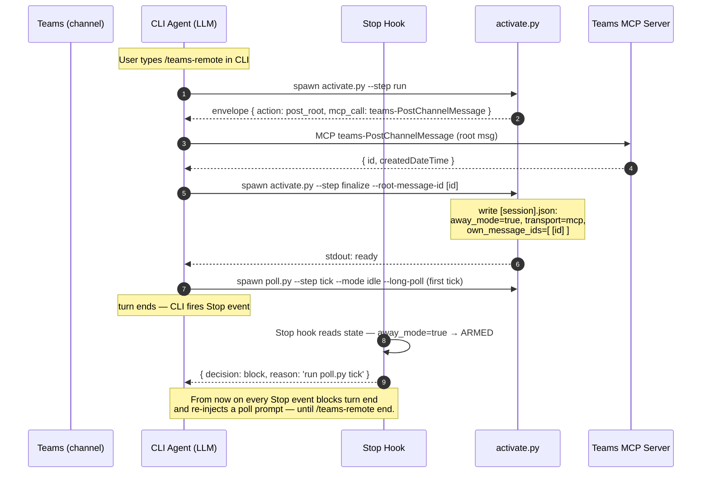
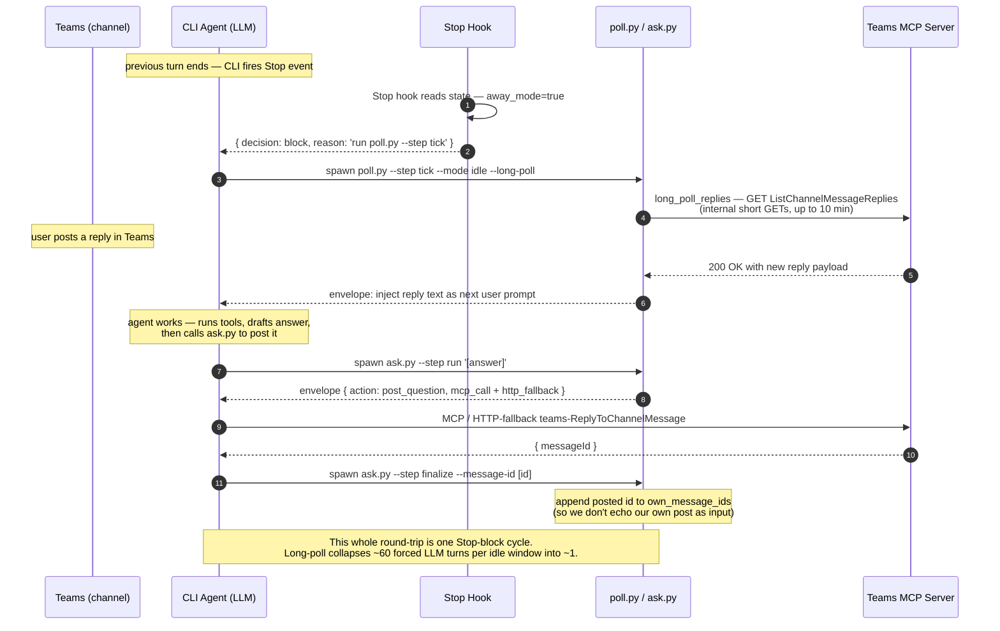
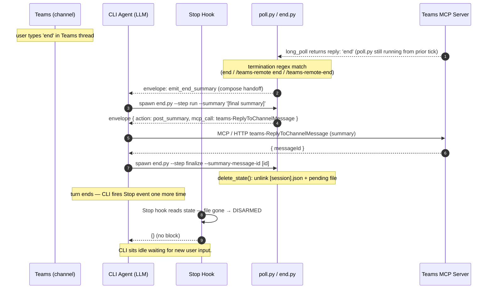
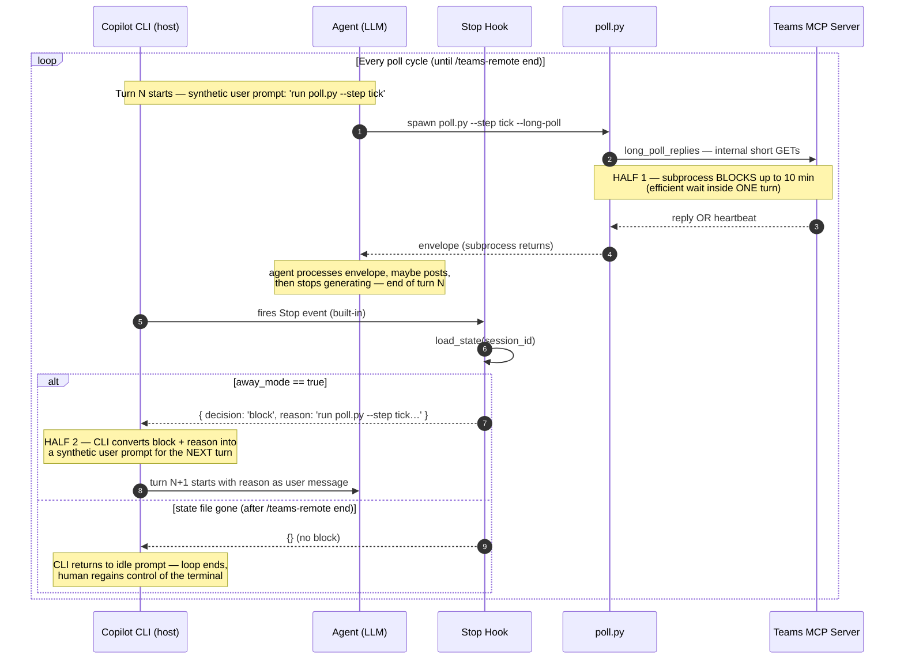

# teams-remote Skill

> A bidirectional Copilot CLI ↔ Microsoft Teams bridge that survives long idle windows by hijacking the Stop hook, refreshing OAuth proactively, and bypassing the CLI's stale bearer with a direct-HTTP fallback.

## Overview

### What it is

- Slash command (`/teams-remote`) shipped by the `general-ops` plugin in this marketplace.
- Bridges the active Copilot CLI session with a chosen Teams channel thread so the user can step away from the terminal.
- Replies the user posts in Teams are injected back as new user prompts; the agent's progress, heartbeats, and answers are posted back to Teams.
- Hardens the naïve "MCP-only" approach with two production-grade features: proactive OAuth token refresh and direct-HTTP fallback.
- Lives at `plugins/general-ops/skills/teams-remote/SKILL.md` with helper Python scripts under `plugins/general-ops/scripts/teams-remote/`.

### Three modes of operation

- **Activation** — `/teams-remote` (no args, or with team/channel hints, or a channel URL). Posts a root message, persists state, flips `away_mode=true`.
- **Away (the loop)** — every turn end, the Stop hook nudges the agent back into a poll cycle. Replies in Teams become injected user prompts.
- **End** — `/teams-remote end` (or natural-language equivalents, or `end` typed in the Teams thread). Posts a summary, flips `away_mode=false`, deletes state.

### Why it exists

- Long-running tasks (builds, evals, refactors) often outlast the user's presence at the keyboard.
- Without a bridge, the user has to keep the terminal in foreground; with the bridge they can monitor and steer from Teams on a phone.
- The "naïve" approach (just call MCP each tick) breaks after ~1 hour because the CLI caches the OAuth bearer at startup and never reloads it after refresh — every call eventually returns `-32001 Request timed out`.

## Workflow Overview

End-to-end sequence diagrams for the three operating modes. Read every diagram with these five actors as the columns:

- **TEAMS** — the user's Teams app on phone or desktop. Source of replies, target of posts.
- **CLI AGENT** — the Copilot CLI's LLM. Spawns scripts, executes MCP/HTTP calls from envelopes, makes decisions.
- **STOP HOOK** — `teams_remote_stop.py`. Fires after every Stop event; reads state; blocks turn end if `away_mode=true`.
- **PYTHON SCRIPTS** — `activate.py` / `poll.py` / `ask.py` / `end.py` + `teams_transport.py`. Emit envelopes; persist state; only `teams_transport.long_poll_replies` makes its own outbound HTTP.
- **TEAMS MCP SERVER** — same endpoint either way. Reached via the CLI's MCP client OR via direct HTTP POSTs after the `-32001` flip.

> Convention used in the diagrams below: solid arrow = call; dashed arrow = return value; a `Note` block summarises the key invariant of the flow.

### 1. Activation — from `/teams-remote` to the listening loop



### 2. Listen-respond loop — Teams reply → work → post answer → listen again



### 3. End — user types `end` in Teams (or `/teams-remote end` in CLI)



## Architecture & Components

### Who actually makes the Teams call?

**The agent does — never the Python script.** The scripts (`activate.py`, `ask.py`, `end.py`, `poll.py`) don't open sockets to Teams. They write a JSON **envelope** to stdout describing the call to make next:

```json
{ "action": "post_question",
  "mcp_call": "teams-ReplyToChannelMessage",
  "mcp_args": { "teamId": "...", "channelId": "...", "messageId": "...", "content": "..." },
  "http_fallback": { "url": "...", "method": "tools/call", "params": { ... } } }
```

The agent (the Copilot CLI's LLM) reads the envelope and executes either the MCP tool from `mcp_call` or the direct HTTP POST in `http_fallback`. The scripts exist to do everything **around** the call that the agent shouldn't redo on every turn:

- Persist per-session state (`away_mode`, `transport`, `own_message_ids`, `last_processed_id`).
- Build the HTML body, `mentions` array, and self-@mention markup.
- Track which message ids we posted (so we don't echo our own replies as user input).
- Detect termination (`end` / `/teams-remote end` regex match).
- Strip `mcp_call` from envelopes once `transport=="http"` so the agent can't fall back into the broken path.
- For long-poll only, `poll.py` does call `teams_transport.long_poll_replies` directly inside the subprocess (10-min blocking GET loop). Outbound posts are always envelope-only.

> One asymmetry today: `activate.py`, `ask.py`, and `end.py` emit only the `mcp_call` half of the envelope — no `http_fallback` sibling. They're one-shot calls rarely on the long idle path; adding HTTP fallback is a follow-up. Only `poll.py` ships the dual-transport contract.

### Files on disk

- `skills/teams-remote/SKILL.md` — the skill prompt the agent reads when invoked.
- `scripts/teams-remote/activate.py` — two-step activation handshake.
- `scripts/teams-remote/poll.py` — the heart of the loop (tick / process / record-* steps).
- `scripts/teams-remote/ask.py` — routes outbound questions to Teams.
- `scripts/teams-remote/end.py` — summary + teardown.
- `scripts/teams-remote/teams_transport.py` — pure-stdlib transport layer (token refresh, SSE parser, HTTP fallback).
- `scripts/hooks/teams_remote_stop.py` — the Stop-hook gate.
- `scripts/lib/state.py` — schema-versioned per-session JSON state.

### Plugin wiring

- `plugins/general-ops/hooks/hooks.json` registers the Stop hook with `matcher: ""` (fires on every Stop event).
- The hook command is `python "${CLAUDE_PLUGIN_ROOT}/scripts/hooks/teams_remote_stop.py"`.
- Two MCP transports are auto-discovered: user-managed OAuth (`~/.copilot/mcp-oauth-config/*.json`) and agency loopback proxy (`%TEMP%\copilot-mcp-*.json`).
- Required MCP tools: `teams-ListTeams`, `teams-ListChannels`, `teams-PostChannelMessage`, `teams-ReplyToChannelMessage`, `teams-ListChannelMessageReplies`.

### State directory

- Path (v1.8.0+): `~/.copilot/session-state/<session-id>/plugins/general-ops/teams-remote/`. On Windows that resolves to `C:\Users\<you>\.copilot\session-state\<session-id>\plugins\general-ops\teams-remote\`.
- Files inside: `state.json` (live state), `pending.json` (out-queue), `activate-pending.json` (mid-handshake only).
- The directory is **per-session** — each CLI session has its own. Cross-session contamination is therefore architecturally impossible: the Stop hook cannot see another session's away state because it never traverses `<other-session-id>/`.
- Hook-crash log (`hook-error.log`) intentionally stays **machine-level** at `<tempdir>/general-ops/hook-error.log`, since hook crashes that fire before reading `session_id` from stdin still need somewhere to log. Rotated to `.old` at 1 MB.
- An override env var `COPILOT_SESSION_ROOT` (or `state.set_session_root(path)`) redirects the root for tests / CI.
- Schema version is `3`; `load_state` returns `None` for any other version (stale state is treated as "no session").

### State lifecycle — when files appear and disappear

| Event | What happens to `state.json` |
|---|---|
| `/teams-remote` (activate finalize) | **CREATED** — `schema_version=3`, `away_mode=true`, `transport="mcp"`, `own_message_ids=[<root-id>]`, `last_processed_id="0"`. |
| Each poll tick / process / `record-*` step | **REWRITTEN** atomically (write `*.tmp` then `os.replace` — no torn reads). |
| `ask.py` / `end.py` finalize step | **REWRITTEN** — appends the posted message id to `own_message_ids` so we don't echo our own posts. |
| First refresh / `-32001` / `401` / `AADSTS*` | **REWRITTEN** — `transport` flips `"mcp"` → `"http"` (sticky, never flips back). |
| `/teams-remote end` (or natural-language end, or `end` typed in Teams) | **DELETED** — `delete_state()` unlinks the file. The empty per-session sub-directory is left for the CLI's own session-state cleanup. |
| Schema bump (e.g. v3 → v4 in the future) | Old files **orphaned** — `load_state` returns `None`, hook treats as "no session". |

So the on-disk file is a perfect mirror of away-mode lifetime: it appears the moment activation succeeds, gets rewritten on every poll, and disappears the moment the session ends.

### Pre-1.8 layout (deprecated)

Versions ≤ 1.7.x used a flat layout under `<tempdir>/general-ops/teams-remote/<session-id>.json`. That model required a Stop hook to glob the directory to discover the away session, which leaked into foreign CLI sessions on the same machine (a session that never invoked `/teams-remote` would still get nudged into someone else's poll loop). v1.8 fixed that by moving to per-session storage.

## Activation Flow

### Two-step handshake

- Step 1 — `activate.py --step run`: resolves team/channel ids, decides whether to `already_active`, ask `need_input`, abort with `error`, or emit a `post_root` envelope with the root-message MCP call.
- The agent executes the root-post MCP call and captures the returned message id and ISO timestamp.
- Step 2 — `activate.py --step finalize --root-message-id <id> --created-iso <ts>`: persists state with `transport: "mcp"`, `away_mode=true`, `last_processed_id: "0"`, `own_message_ids: [<root-id>]`.
- Emits `ready`. The next assistant turn must immediately call `poll.py --step tick --mode idle`.
- Optional `--user-id <guid>` enables the self-mention notification hack (every reply ends up at-mentioning the away user so Teams sends a push).

### Post-activation invariants

- `away_mode=true` is now persisted on disk — the Stop hook will start blocking turn endings.
- `transport` defaults to `"mcp"`; flips to `"http"` only on the first refresh / `-32001` / 401 / `AADSTS*`.
- `own_message_ids` already contains the root post so the poll loop never echoes it as user input.

## The Idle-Poll Loop

### Long-poll vs short-poll

- **Long-poll (preferred)** — `poll.py --step tick --mode idle --long-poll` blocks inside the subprocess for up to ~10 minutes doing internal HTTP GETs. Returns a single `poll_result` envelope with replies already fetched.
- **Short-poll (fallback)** — emits an envelope with `mcp_call`, `mcp_args`, and `sleep_seconds`. The agent must execute the MCP call itself, then call `--step process`.
- Long-poll collapses ~60 forced LLM turns per idle window down to ~1 (huge token-cost reduction).
- The fallback is only used when neither OAuth disk config nor agency proxy is discoverable.

### Action branching after `--step process`

- `inject` — each unread reply becomes a new user prompt; the envelope provides an `ack_template` to post in **parallel** with the first real-work tool call.
- `terminate` — user replied `end` / `/teams-remote end` / `/teams-remote-end` in Teams → jump to End Flow with reason `remote-triggered`.
- `heartbeat` — periodic "still working" post; record its id back via `--record-own-id <id> --record-own-kind heartbeat`.
- `continue` — nothing actionable, loop again. If `truncated: true`, shorten `pollIntervalSeconds`.
- `poll_result` — long-poll only; pipe straight into `--step process`.

### Envelopes carry both transports

- Every tick emits `mcp_call` + `mcp_args` AND an `http_fallback` sibling.
- Top-level `transport` field signals which to prefer (`"mcp"` default, `"http"` after a flip).
- `http_fallback` shape varies by discovery: `auth: "bearer"` (OAuth disk, fully-qualified `teams-…` tool name) or `auth: "none"` (agency loopback proxy, prefix stripped).

## Stop-Hook Integration

### Where it sits in the agentic loop

- The Copilot CLI emits a `Stop` event when the model returns `end_turn` and the agent is about to terminate the current turn (see `CopilotCliAgenticLoopAndHooks.md` §Hook Events).
- A `Stop` hook can return `{"decision": "block", "reason": "..."}` on stdout to **force another turn**; the reason text becomes the next user prompt.
- `teams-remote` registers exactly such a Stop hook with an empty matcher so it runs after every turn.

### What `teams_remote_stop.py` actually does

- Reads the JSON payload the CLI pipes on stdin and extracts the firing session's `session_id`.
- Calls `load_state(session_id)` directly — the per-session storage layout (v1.8.0+) means there is exactly one place this could exist: `~/.copilot/session-state/<session-id>/plugins/general-ops/teams-remote/state.json`. No glob, no chance of seeing a sibling session.
- If the current session has no state file, or `away_mode != true` → `return 0` with no stdout. The CLI sees no `decision` and the turn ends normally.
- If the current session **is** in away mode → emits `{"decision": "block", "reason": "<idle-poll instructions>"}` referencing the firing session's ID. The CLI forces another turn whose user message is that reason.
- Fail-open: missing or malformed stdin payload → no block.
- Wraps everything in a top-level `try/except` and logs to `hook-error.log` (machine-level) — a hook crash never blocks the user.

### Why session isolation is automatic now

- Hooks declared in `hooks/hooks.json` fire on **every** Copilot CLI Stop event for the user, regardless of which session activated `/teams-remote`. The hook schema does not support per-session matchers.
- Pre-1.8 the hook handled this by globbing the flat state directory and returning the first away session it found — which leaked across sessions (a foreign CLI session would see another session's away state and get dragged into its poll loop).
- v1.8+ stores state under `~/.copilot/session-state/<session-id>/...`. The hook resolves its directory from `session_id` (which the CLI passes on stdin), so it can only ever read the firing session's own state. No filtering logic needed; the storage layout enforces isolation.

### What the block reason tells the agent

- Reminds it the session is `away_mode=true` and gives the exact command sequence: `poll.py --step tick --mode idle --long-poll --session-id <SID>` then `--step process`.
- Spells out the four possible `--step process` actions (`inject` / `terminate` / `heartbeat` / `continue`).
- Includes fallback guidance: drop `--long-poll`, add `--with-sleep`, switch to `http_fallback` if `transport==http` or on `-32001` / 401 / `AADSTS`.
- Only `/teams-remote end` flips `away_mode=false`, so this is the **only** way out of the loop.

### How the loop never ends — two mechanisms working together

Long-poll explains how *one tick* waits efficiently; the Stop hook is what makes another tick *always follow*. Without the Stop hook, the loop ends after the first tick.

- **Half 1 — long-poll keeps the *current* subprocess productive.** `poll.py --long-poll` blocks the powershell-tool subprocess inside `teams_transport.long_poll_replies` for up to 10 minutes, waiting for either a Teams reply or a heartbeat. The CLI just sits on `subprocess.communicate()` — same as any other shell-tool call. One LLM turn covers up to 10 minutes of wall-clock time instead of forcing 600 separate 1-second turns.
- **Half 2 — the Stop hook causes the next turn to *exist*.** When the agent finishes processing the subprocess output and **stops generating**, the Copilot CLI fires its built-in `Stop` event. `teams_remote_stop.py` reads the state file and returns `{"decision": "block", "reason": "run poll.py --step tick…"}`. The CLI's contract for `decision: block` is: don't return control to the human — instead deliver `reason` as a synthetic user prompt and start a new turn immediately. The agent thinks the user just typed "run poll.py --step tick" and obediently does so. Long-poll blocks again. Repeat.
- **Exit.** Only `end.py --step finalize` calls `delete_state()`. On the next Stop event the hook finds no state file → returns `{}` (no block) → CLI returns to its idle prompt → loop ends → human regains control.

Without Half 2 the loop dies after one tick: `poll.py` would return, the agent would finish its turn naturally, and the CLI would idle. Without Half 1 the loop still works but turns into a busy-wait — every minute would burn a fresh LLM turn just to call `poll.py --step tick` and immediately get back "no replies yet."



A practical consequence: if the Stop hook ever crashed and didn't return `{}`, the CLI would either kill the loop or, worse, kill the whole CLI. That's why `teams_remote_stop.py` is wrapped in a top-level `try/except` that logs to `hook-error.log` and falls back to "no block" — a hook failure must never take the user's terminal down.

## Bypassing -32001 (Token-Refresh Bug)

### Why MCP calls eventually fail

- The Copilot CLI loads the Teams MCP OAuth bearer **once at process startup** and caches it in memory.
- Bearer lifetime is typically ~1 hour. After that, the MCP server rejects the call.
- The CLI surfaces this as `McpError -32001: Request timed out` (sometimes 401 or an `AADSTS*` token error).
- Restarting the CLI is not an option for an unattended away session.

### The proactive refresh (in `teams_transport.ensure_fresh_token`)

- At the top of every `poll.py --step tick`, the loop calls `find_teams_mcp_config()` to locate `~/.copilot/mcp-oauth-config/<name>.tokens.json` (matched by `serverUrl` containing `mcp_TeamsServerV1`).
- `ensure_fresh_token` checks `expiresAt - now`. If ≤ 600 s (10 min skew), it POSTs a `refresh_token` grant to `https://login.microsoftonline.com/common/oauth2/v2.0/token`.
- New tokens are written back atomically with camelCase keys (`accessToken` / `refreshToken` / `expiresAt`) so the CLI's on-disk file stays in sync.
- Returns `{"refreshed": True}` — the loop reacts by flipping state to HTTP.

### The HTTP fallback flip

- The moment `ensure_fresh_token` returns `refreshed=True`, `poll.py` sets `state["transport"] = "http"` and persists.
- From that tick onward, every envelope carries `transport: "http"` and the agent is expected to execute `http_fallback` instead of `mcp_call`.
- `--step record-mcp-error --code -32001` does the same flip reactively when an MCP call returned the dreaded error before refresh fired.
- **Once on HTTP, stay on HTTP for the rest of the session.** The CLI's cached bearer never catches up; flipping back would just reproduce the bug.

### Two HTTP fallback shapes

- **OAuth (user-managed)** — `auth: "bearer"`, `tokens_path` points at the on-disk tokens file, body is a JSON-RPC `tools/call` with the fully-qualified `teams-…` tool name. Agent attaches `Authorization: Bearer <accessToken>`.
- **Agency loopback proxy** — `auth: "none"`, `url` is `http://127.0.0.1:<port>`, tool name has the `teams-` prefix stripped (e.g. `ListChannelMessageReplies`). No `Authorization` header — the proxy injects M365 auth upstream.
- Both must send `Content-Type: application/json` and `Accept: application/json, text/event-stream`.
- Response body is SSE-formatted with **triple-nested** JSON; parse with `teams_transport.parse_sse_response` — never regex (Unicode escapes will silently break it).
- An SSE parse failure is treated as an **error**, not as "no replies" — silently dropping replies is the worst-case bug.

## Session State Storage

### Schema (v3)

| Key | Purpose |
|---|---|
| `schema_version` | Always `3`; mismatched versions are loaded as `None` (treated as "no session") |
| `session_id` | The Copilot CLI session id this state belongs to |
| `away_mode` | Boolean — `true` means the Stop hook will block; only `end.py` flips it false |
| `transport` | `"mcp"` (default) or `"http"` (sticky after first refresh / -32001) |
| `team_id` / `channel_id` | Resolved Graph ids the loop posts into |
| `root_message_id` / `root_created_iso` | Activation post id; threaded replies hang under it |
| `own_message_ids` | List of every id we've authored — ack, heartbeat, progress, ask, end summary |
| `last_processed_id` | Decimal-string max id we've processed; numeric floor against clock-skew replays |

### When state is written

- `activate.py --step finalize` — initial save with `away_mode=true`, `transport="mcp"`, root post recorded.
- Top of every `poll.py --step tick` — after `ensure_fresh_token` may have flipped `transport` to `"http"`.
- `--step process` — after each successfully-processed reply: appends to `own_message_ids` for any acks/heartbeats we'll emit, bumps `last_processed_id`.
- `--step record-own` — explicit add-to-`own_message_ids` after the agent posts an ad-hoc reply.
- `--step record-mcp-error` — flips `transport="http"` and increments `mcp_timeout_streak`.
- `ask.py --step finalize` — records the question id we just posted.

### When state is read

- `teams_remote_stop.py` — every Stop event, scans the directory and picks the first `away_mode=true` session.
- Every `poll.py` step starts with `load_state(session_id)`.
- `end.py` reads it once to compose the summary, then deletes the file.

### Lifetime & cleanup

- Files live until `end.py --step finalize` deletes them.
- `run_stale_cleanup(older_than_hours=24)` runs at the top of activation and reaps any state file older than 24h whose CLI session is no longer alive.
- Schema-version mismatches are reaped the same way — a plugin upgrade with a v4 schema simply makes all v3 files invisible until cleanup.

## Self-Filter & Deduplication

### Two-layer defence against echo loops

- Layer 1 — `own_message_ids` set. Every id the agent posts (root, asks, acks, heartbeats, progress, end summary) goes in. The poller skips any reply whose id is in this set.
- Layer 2 — `last_processed_id` numeric floor. Each processed reply id is parsed as an int; the max is persisted. Future ticks skip any reply whose `int(reply_id) <= last_processed_id`.
- Why two layers: clock-skewed Graph timestamps can re-surface "older" replies; numeric ordering on the monotonic id space is a stronger guarantee than timestamp comparison.
- Filtering is by **id**, never by sender — the agent posts on behalf of the signed-in user, so `from.userId` is identical for inbound and outbound messages.

### Termination detection

- Inbound replies are matched against `^\s*(end|/teams-remote\s+end|/teams-remote-end)\s*$` (case-insensitive).
- A match emits `action: "terminate"` with reason `remote-triggered`.
- The agent must run `end.py --step run --reason remote-triggered` next, not pretend to keep working.

## Posting Rules (Non-Negotiable)

### Every Teams post needs three pieces

- **Visible prefix** — content begins with the literal string `Copilot agent message:` so the user can distinguish agent posts from their own.
- **In-content self-@mention** — content begins with `@DisplayName` (literal at-sign + the away user's display name). Recommended: `@DisplayName Copilot agent message: …`.
- **`mentions` argument** — JSON-stringified array `[{"displayName": "Lior Zivi", "id": "<guid>", "type": "user"}]` matching the in-content mention.
- Forgetting `mentions` is the #1 cause of "you didn't ping me" — the away user gets no push notification.

### Plain text only for ad-hoc posts

- Set `contentType: "text"` on `teams-ReplyToChannelMessage` / `teams-PostChannelMessage` / `teams-SendMessageToChat`.
- The MCP server expands `@DisplayName` into proper Teams mention markup automatically when `mentions` is present — do **not** author `<at>...</at>` tags yourself.
- Never write raw HTML (`<p>`, `<br>`, `<ul>`, `<b>`, `<at>`, `<div>`, etc.) — Teams renders most hand-rolled HTML inconsistently.
- Use `\n` for line breaks, `- ` for bullets, `*asterisks*` or sparing ALL-CAPS for emphasis.
- The HTML envelopes from `activate.py`, `end.py`, and `_apply_mention_hack` use a tiny controlled subset and are the only sanctioned HTML on the wire.

### Acknowledge in parallel with starting work

- When the poll loop returns `inject`, post the ack and the first real-work tool call as **parallel tool calls in a single response**.
- This guarantees a hung MCP can never block forward progress.
- The ack should paraphrase what was understood in ≤2 sentences — proves the agent actually read the message.

## End Flow

### Two-step teardown

- Step 1 — `end.py --step run --reason <code>`: composes a summary, emits `post_summary` envelope (or `no_session` if state is missing). The agent executes the MCP/HTTP call.
- Step 2 — `end.py --step finalize`: deletes the state file. Emits `ok`.
- If the summary post fails, **still proceed to step 2** — the session is logically closed regardless.
- After `ok`, a future `/teams-remote` invocation starts a **fresh** activation; there is no resume.

### Reason codes

| `--reason` | When it's used |
|---|---|
| `user-invoked` | Default. User typed `/teams-remote end` or a natural-language end phrase in the CLI |
| `remote-triggered` | Idle-poll matched a termination string in a Teams reply |
| `session-ended` | Reserved for future use; currently unset by any caller |

### Termination matrix

- User runs `/teams-remote end` in CLI → End Flow with `user-invoked`.
- User replies `end` / `/teams-remote end` / `/teams-remote-end` in Teams → poll returns `terminate` → End Flow with `remote-triggered`.
- CLI session exits without cleanup → no summary; stale state reaped on the next activation.

## Edge Cases & Hardening

### Configuration discovery failures

- `find_teams_mcp_config()` returns `None` when no OAuth disk config exists yet → loop logs a one-line stderr note and emits envelopes **without** `http_fallback`. Stays on MCP.
- `find_agency_teams_proxy()` scans `%TEMP%\copilot-mcp-*.json` newest-first; trusts only loopback URLs (`127.0.0.1` / `localhost`).
- If both fail, MCP-only operation continues — refresh and HTTP fallback are simply unavailable, and a long enough idle window will hit the `-32001` cliff.

### Agency proxy may be read-only

- Some agency-hosted Teams MCP loopback proxies expose **only read** tools (no `PostChannelMessage` / `ReplyToChannelMessage`).
- Always verify `tools/list` against the proxy before activating.
- If write tools are missing, the skill should refuse to activate rather than silently degrading.

### One-shot scripts vs the loop

- `activate.py`, `ask.py`, and `end.py` currently emit MCP-only envelopes (no `http_fallback` sibling).
- The agent retries them once on `-32001`; they're rarely on the long-running hot path.
- A future PR will add HTTP fallback siblings to these too for full symmetry.

### What can't be guessed

- Team / channel ambiguity (multiple matches by name) is an **error**, not a guess. The skill must surface the ambiguity for human resolution.
- A reply with a non-numeric id is a hard failure of an upstream invariant — the numeric `last_processed_id` floor only works because Teams reply ids are monotonic decimal strings.

## Key Takeaways

### Why the design works

- The Stop hook turns "end of turn" into "end of one cycle of the idle loop" — keeping the agent alive without a separate daemon.
- Proactive refresh + sticky HTTP fallback dodges the CLI's most painful long-session bug (`-32001` from a stale cached bearer).
- Schema-versioned per-session state keeps multi-session and multi-version installs from clobbering each other.
- Two-layer dedup (id-set + numeric floor) prevents the agent from ever talking to itself, even under clock skew.

### Operational rules to remember

- Only `/teams-remote end` flips `away_mode=false` — nothing else escapes the Stop-hook block.
- Once `transport=="http"`, never flip back; the cached bearer in the CLI process will not catch up.
- Every Teams post: prefix + `@DisplayName` + `mentions` array. All three. Always.
- An SSE parse `None` is an **error**, never "no messages" — silently empty replies is the worst-case bug.
- Long-poll first; fall back to short-poll only when transport discovery fails.
